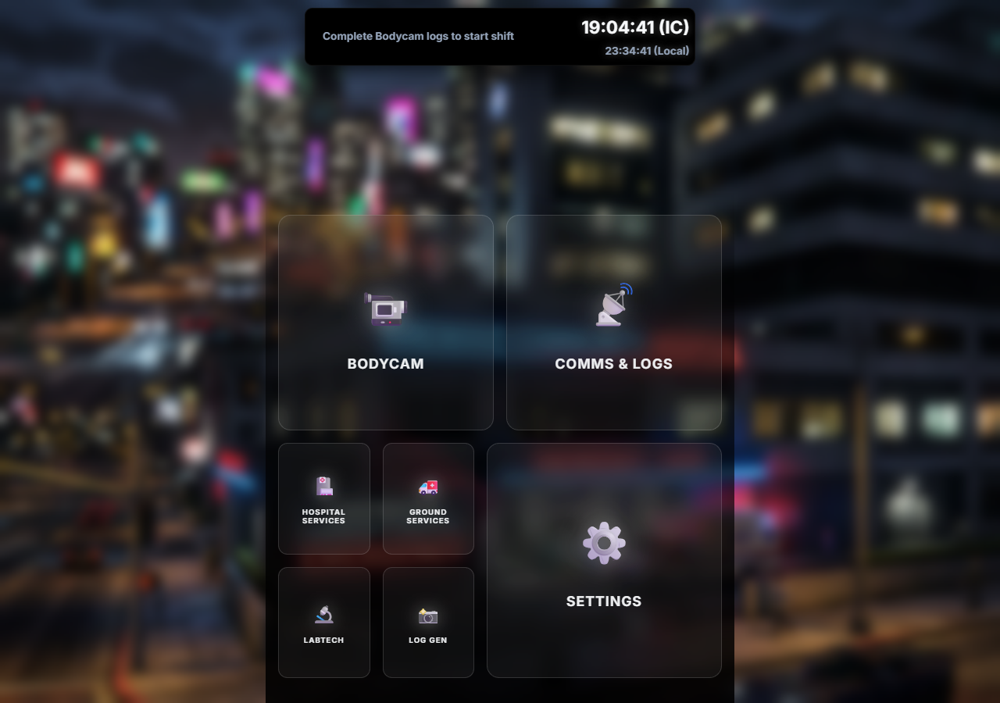

# EMS Employee Companion - User Documentation

Welcome to the **EMS Employee Companion**, your all-in-one web application designed to streamline Emergency Medical Services (EMS) operations. This guide will walk you through the core features of the app with screenshots.

## 1. Full Dashboard Overview

Upon launching the application, you'll be greeted by the main dashboard after the boot sequence completes.

The dashboard is divided into several main sections:
- **Top Status Bar**: At the very top, you'll see a dynamic island that manages your duty status and shift timer.
- **Discord Log Automation**: The section that helps generate and copy Discord logs.
- **Settings & Modals**: Various other controls and configurations to tailor the app to your profile.

---

## 2. Shift Timer & Duty Tracking

Tracking your duty time has never been easier. Use the top status bar to start and end your shift.

### **Starting Your Shift:**
1. Click on the location dropdown to select where you'll be stationed (e.g., `PH Front`, `SH`, `Calls`).
2. If your location isn't listed, you can type a custom location.
3. Click the **Play Button (▶)** to begin your shift timer.

### **Ending Your Shift:**
1. Once on duty, the timer will keep track of your hours continuously (even if you refresh the browser).
2. Click the **Stop Button (⏹)** to clock out. 
3. A confirmation prompt will appear to ensure you don't end your shift accidentally.

---

## 3. Discord Log Automation

The app automatically generates strictly formatted Discord logs so you don't have to type them out manually.

### **How to Use the Log Generator:**
1. Locate the main action buttons in the center of the dashboard (e.g., `Going 10-9 (Break)` or standard logs).
2. Click on the action you are performing.
3. The correct log message will be automatically generated and copied to your clipboard.
4. **Deep-linking:** If you have configured your Discord channels in the settings, you can click to directly open the relevant Discord channel to paste your log.

---

## 4. Settings and Customization

Click the **Settings (⚙️)** button (usually accessible from the modals overlay or main view) to personalize your app.

### **My Info:**
- Enter your **Name** and **ID**. This information is used dynamically in your radio communications and generated logs.

### **Discord IDs Configuration:**
- Enter your EMS Discord Server ID and specific Channel IDs (like `#BODYCAM-LOGS`, `#BREAK-ROOM`).
- You can test these links directly from the settings menu to ensure they route you to the correct channel.

### **Data Backup:**
- **Export/Import:** Since your data is stored locally in the browser, you can export it as a `db.txt` file and import it on another device to seamlessly carry over your custom configurations.

---

## Tips & Best Practices
- **Variables in Templates:** Familiarize yourself with placeholders like `{LOC}` and `{NAME}`. When you set your global inputs, these will instantly update across all your copy-paste templates.
- **Keep it Open:** Keep the companion app open in a secondary monitor or background tab while on duty to have quick access to radio codes and the shift timer.
