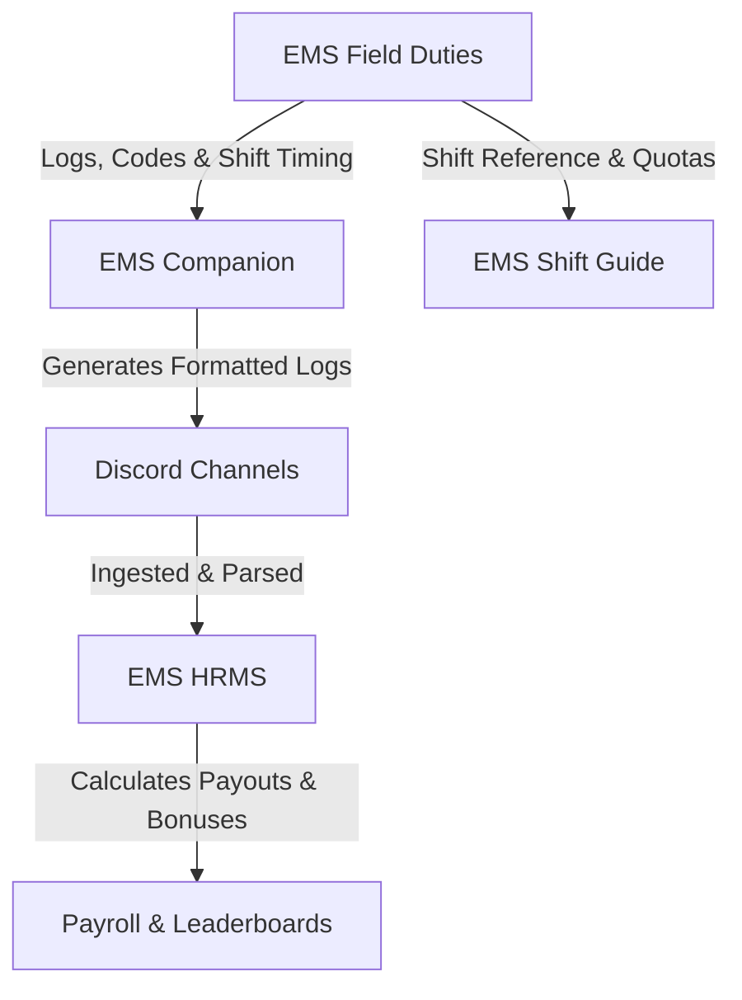
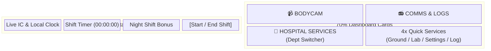

# 🚑 GTA5GRP


Welcome to the **GTA5GRP** repository! This project is an all-in-one frontend software suite built for Grand RP (GRP). It streamlines daily Emergency Medical Services (EMS) field operations, bodycam logs, shift timing, departmental comms, high-command HR/payroll management, and market radar tools.

---

## 🏗️ Project Ecosystem

The repository contains four specialized applications deployed via Firebase Hosting:



1. **[EMS Companion](EMS%20Companion/)** 🩺 — In-game dashboard with Dynamic Island shift timer, quick logs, radio codes, and an Android Auto-style split layout (`https://ems-companion-gtav-grp.web.app`).
2. **[EMS HRMS](EMS%20HRMS/)** 📊 — High Command administration suite for parsing Discord logs, tracking roster hours, calculating bonuses, and exporting payroll (`https://ems-hrms-gtav-grp.web.app`).
3. **[EMS Shift Guide](EMS%20Shift%20Guide/)** ⏱️ — Dedicated shift tracker and reference guide for duty quotas and medical procedures (`https://ems-shift-guide-gtav-grp.web.app`).

---

## 1. 🩺 EMS Companion

The **EMS Companion** is an interactive, glassmorphism-styled field dashboard optimized for dual-monitor setups, mobile devices, in-game browser overlays, and car dash displays.

### ✨ Key Features

- **Dynamic Island Shift & Rota Timer**:
  - Live **IC Time** and **Local Time** clocks.
  - One-click shift start/stop with customizable locations (Pillbox Front/Back, Sandy Shores, Calls, Labs, Training, Custom).
  - Night shift bonus tracker with active earnings indicator.
  - Animated progress outline SVG surrounding the widget.
- **Android Auto 30/70 Split Layout**:
  - Automatically activates on low height, compact screens, or automotive displays (e.g. 800x480, 960x540, mobile landscape).
  - **Left 30% Panel**: Dedicated Rota Shift widget (clocks, glowing neon cyan timer, night shift bonus, and touch controls).
  - **Right 70% Panel**: Dashboard navigation cards arranged in a clean 2-row grid.
- **Bottom-Sheet Modal Animations**:
  - Smooth bottom slide-in when opening (`translateY(100%)` to `0`) and slide-out to bottom when closing (`0` to `translateY(100%)`).
  - Native `Escape` key dismiss and backdrop tap close.
- **Zoom-Locked Interface**:
  - Prevents accidental zooming on touchscreens, car displays, and mobile WebViews via viewport scaling locks, CSS `touch-action`, multi-touch pinch prevention, and keyboard shortcut blocks.
- **De-Jittered High-Performance UI**:
  - GPU-accelerated transforms (`translate3d`) with targeted property transitions to prevent subpixel font blur and redraw jitter.
- **Operational Modules**:
  - 📹 **Bodycam**: Automated log generator for On-Duty/Off-Duty transitions and copy-to-clipboard workflows.
  - 📻 **Comms & Logs**: 10-codes reference, department commands, and customizable user categories.
  - 🏥 **Hospital Services**: Quick switcher between Pillbox Hill, Sandy Shores, Ground Services, Labtech, Settings, and Log Gen.
  - 📝 **Quick Notepad**: Floating notes drawer with auto-save and one-click copy.

### 🖼️ Wireframe & Layout Modes



---

## 2. 📊 EMS HRMS (Human Resources Management System)

The **EMS HRMS Portal** is the administrative command center for EMS High Command to process attendance, calculate wages, and manage the faction roster.

### ✨ Features
- **Discord Log Parser**: Parses raw Discord duty channel logs using regex and fuzzy string matching.
- **Automated Payroll Engine**:
  - Base wages calculation ($1,300/hour base).
  - Day vs. Night shift bonus differential multipliers.
  - Location-specific bonuses (PH Front, Sandy Shores, Labs, Calls).
- **Timezone Normalization**: Converts Indian Standard Time (IST) timestamps to British Summer Time (BST) for in-game server night shift alignment.
- **Encrypted Local Storage**: Secures employee records and sensitive payroll data in the browser via CryptoJS encryption.
- **Roster & Promotions**: Track promotions, active members, weekly quotas, and leaderboard payouts.

---

## 3. ⏱️ EMS Shift Guide

The **EMS Shift Guide** is a focused reference and time-tracking utility for individual medical personnel.

### ✨ Features
- **Shift Duration Counter**: Real-time counter to verify minimum shift requirements.
- **Quota Tracking**: Visual progress indicators for daily/weekly quota compliance.
- **Medical SOP Reference**: Quick lookups for patient treatments, triage levels, and medication protocols.
- **Consistent Glass Aesthetic**: Matches the visual design system of the Companion App.

---

## 🛠️ Technology Stack

| Component | Technologies Used |
| :--- | :--- |
| **Architecture** | Pure Vanilla Web Stack (HTML5, CSS3, ES6+ JavaScript) |
| **Design System** | Glassmorphism, CSS Grid, Flexbox, JetBrains Mono, Inter, Google Material Symbols |
| **Animations** | Hardware-accelerated CSS `translate3d`, Cubic-Bezier timing curves |
| **Security** | CryptoJS for LocalStorage encryption |
| **Styling (HRMS)** | Tailwind CSS |
| **Hosting & Deploy** | Firebase Hosting multi-target deployment |

---

## 🚀 Deployment & Local Setup

### Running Locally
To run any of the apps locally, you can serve the directory using any static web server (e.g. Python, Node, or VSCode Live Server):

```bash
# Serve EMS Companion
python -m http.server 8080 --directory "EMS Companion"

# Serve EMS HRMS
python -m http.server 8081 --directory "EMS HRMS"

# Serve EMS Shift Guide
python -m http.server 8082 --directory "EMS Shift Guide"

# Serve Marketplace Radar
python -m http.server 8083 --directory Marketplace
```

Open your browser at `http://localhost:8080`.

### Firebase Deployment
The repository is pre-configured with multi-target hosting in [`firebase.json`](firebase.json):

```bash
# Deploy all targets
firebase deploy

# Deploy only EMS Companion (https://ems-companion-gtav-grp.web.app)
firebase deploy --only hosting:companion

# Deploy only EMS HRMS (https://ems-hrms-gtav-grp.web.app)
firebase deploy --only hosting:hrms

# Deploy only EMS Shift Guide (https://ems-shift-guide-gtav-grp.web.app)
firebase deploy --only hosting:shift

# Deploy only Marketplace Radar (https://marketplace-companion-gtav-grp.web.app)
firebase deploy --only hosting:marketplace
```

---

## 📄 License
Maintained for the Grand RP EMS Community. Designed and engineered for high-performance roleplay operations.
