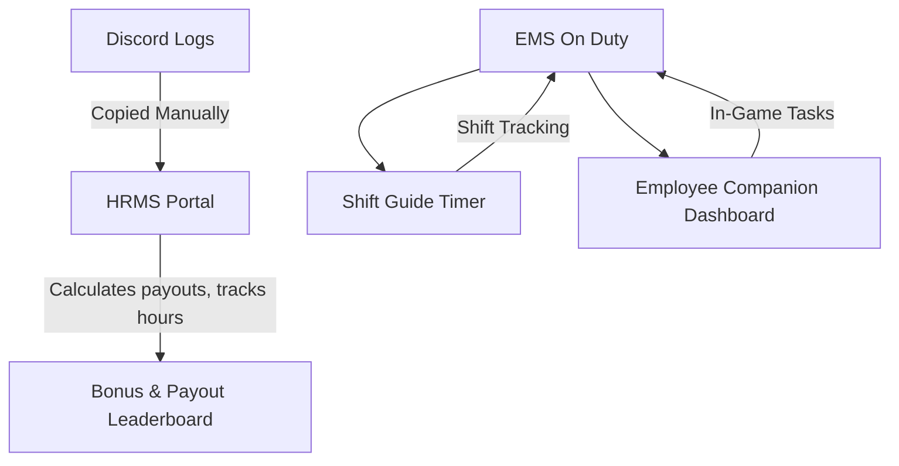
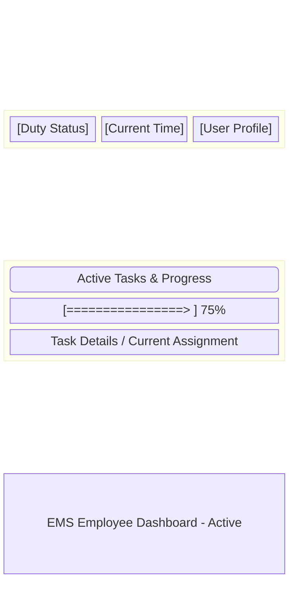
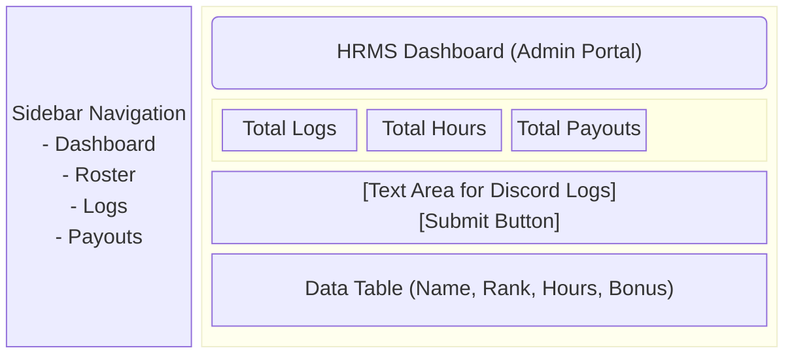
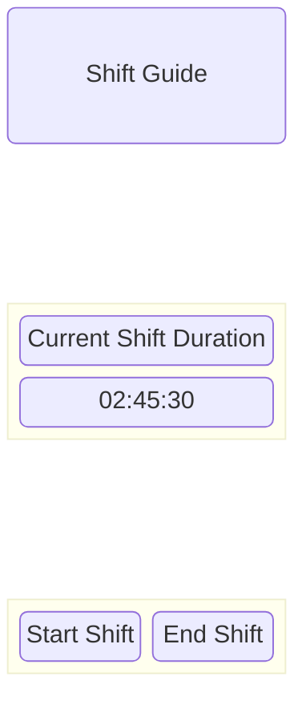

# 🚑 GTA V GRP EMS Assist

Welcome to the **GTA V GRP EMS Assist** repository! This project is a comprehensive suite of front-end applications built for the Grand RP (GRP) EMS faction. It provides a cohesive ecosystem of tools for everyday duties, HR management, and shift tracking.

---

## 🏗️ Project Ecosystem

The ecosystem consists of three interconnected web-based applications:

1. **Employee Companion** 🩺
2. **HRMS (Human Resources Management System)** 📊
3. **Shift Guide** ⏱️

### Ecosystem Architecture

---

## 1. 🩺 Employee Companion

The **Employee Companion** is a lightweight dashboard designed for on-the-go or secondary-monitor use by an EMS employee. It tracks ongoing medical procedures, task progress, and other real-time details required on duty.

### ✨ Features
- **Visual Progress Tracker**: Provides an aesthetic progress bar tracking ongoing tasks and duty milestones.
- **Glassmorphism UI**: Uses a blurred overlay for a sleek, modern UI.
- **Top Status Bar**: At-a-glance status metrics for the current shift.

### 🖼️ Wireframe

---

## 2. 📊 HRMS (Human Resources Management System)

The **HRMS Portal** is the administrative powerhouse of the EMS faction. Designed for High Command and management, it ingests shift logs, calculates base wages, applies complex bonus structures, and maintains a roster of employees.

### ✨ Features
- **Discord Log Ingestion**: Parses raw Discord "On/Off Duty" logs using fuzzy-matching and regex.
- **Automated Payout Calculations**: Factors in day/night shifts, specific locations (PH front, SH, Labs, Calls), and base wages ($1,300/hr).
- **Timezone Normalization**: Automatically converts IST log timestamps to BST for accurate night shift bonuses.
- **Data Persistence**: Uses encrypted Browser `LocalStorage` via CryptoJS.

### 🖼️ Wireframe

---

## 3. ⏱️ Shift Guide

The **Shift Guide** focuses strictly on time management for individual shifts. It acts as a dedicated overlay or companion app that ensures employees meet their hourly quotas and avoid accidental short-shifting.

### ✨ Features
- **Shift Duration Timer**: Counts down or up depending on duty status.
- **Quota Tracking**: Visual indicators if minimum required time is met.
- **Modern Styling**: Styled identically to the Employee Companion for a unified aesthetic.

### 🖼️ Wireframe

---

## 🛠️ Technology Stack
- **HTML5 & CSS3**: Core layout and styling (Glassmorphism aesthetics).
- **Vanilla JavaScript**: All business logic, parsers, and timers.
- **Tailwind CSS**: Rapid UI development (used extensively in the HRMS).
- **CryptoJS**: LocalStorage encryption for HRMS data security.
